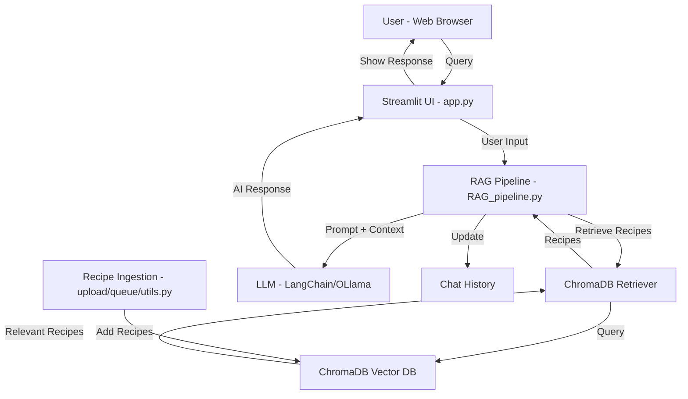

# 🍽️ AI Recipe Assistant with Chat History & RAG

An intelligent recipe assistant built with **Streamlit**, **LangChain**, and **ChromaDB**, capable of:

- Answering cooking-related queries
- Recalling past conversations with chat history
- Searching a recipe database using Retrieval-Augmented Generation (RAG)
- Streaming AI responses in real-time

---

## 🚀 Features

- **Chat History**: Your previous conversation is remembered during a session
- **RAG Integration**: Fetches relevant recipes from the vector database
- **Streaming Responses**: See AI answers in real-time
- **Persistent Storage**: Recipes stored locally in ChromaDB

---

## 🛠️ Tech Stack

- **Python 3.10+**
- [Streamlit](https://streamlit.io/)
- [LangChain](https://www.langchain.com/)
- [ChromaDB](https://www.trychroma.com/)
- [OLlama](https://www.ollama.com)

---

## 📂 Project Structure

```
Prepare_Hack/
├── data/
│   ├── recipes_raw_nosource_ar.json
│   ├── recipes_raw_nosource_epi.json
│   ├── recipes_raw_nosource_fn.json
│   └── test.json
├── RAG/
│   ├── .env
│   ├── docker-compose.yml
│   ├── requirements.txt
│   └── src/
│       ├── app.py                # Streamlit app entry point
│       ├── config.py             # Environment/config management
│       ├── RAG_pipeline.py       # RAG pipeline logic
│       ├── lib/
│       │   ├── chroma_database.py
│       │   ├── chroma_store.py
│       │   └── ...               # Other utility modules
│       ├── chroma_data/
│       │   └── chroma.sqlite3    # Local ChromaDB storage
│       ├── chroma_db/
│       ├── upload/
│       │   └── queue/
│       │       └── utils.py      # Data ingestion helpers
│       └── test.py
└── script.py
```

---

## 🖼️ How it Works (Architecture Diagram)



---

## 📦 Installation

1. **Clone the repository**

```bash
git clone https://github.com/hediske/ChefAI.git
cd Prepare_Hack/RAG
```

2. **Create a virtual environment**

```bash
python -m venv venv
source venv/bin/activate   # macOS/Linux
venv\Scripts\activate      # Windows
```

3. **Install dependencies**

```bash
pip install -r requirements.txt
```

4. **Set environment variables**
   Create a `.env` file in `Prepare_Hack/RAG/`:

```env
'CHROMADB_DIRECTORY' = "YOUR_DIRECTORY"
'CHROMADB_CLOUD_HOST' = "YOUR_CLOUD_HOST"
```

---

## 📤 Upload Recipes to the Database

You can upload your own recipes to ChromaDB:

1. Place your recipe JSON files in `Prepare_Hack/data/` (see sample files like `test.json`).

2. Use the ingestion script to process and upload recipes:
   For the type it can be : `recipe` if you want a recipe with the same

```bash
python -m upload.app --file <file-path> --type <type>
```

Or, if you have a full folder to embed you can do it in batch:

```bash
python -m upload.app --folder <folder-path> --type <type>
```

This will process your recipes and store the embeddings in `src/chroma_data/chroma.sqlite3`.

For Our case we used data from Internet to create the recipe suggestions :
[Link to The dataset](https://eightportions.com/datasets/Recipes/)

---

## ▶️ Running the App

```bash
streamlit run src/app.py
```

Open your browser and go to:

```
http://localhost:8501
```

---

## 💡 Example Queries

- "Show me vegetarian pasta recipes"
- "I want a dessert with chocolate"
- "What can I cook with chicken and lemon?"

---

## ✨ Why This Project is Special

- **Combines memory and retrieval**: You can have a natural conversation and still pull from a recipe database.
- **Modular design**: Easy to swap datasets, LLMs, or prompts.
- **Fast**: Uses local ChromaDB for quick recipe retrieval.
- **Scalable**: Can be expanded to multiple cuisines, nutrition info, or personalized recommendations.

---

## 📜 License

MIT License © 2025 Hedi <3
